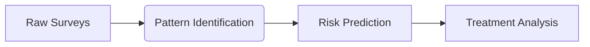
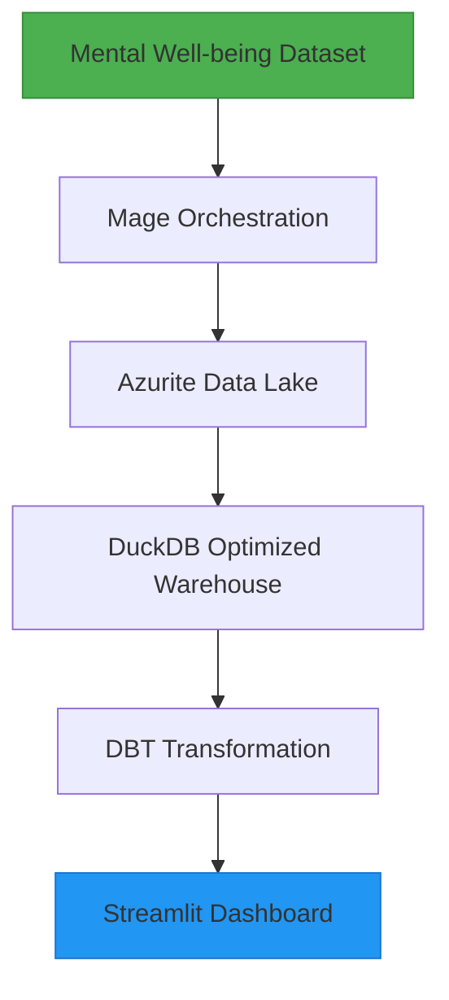

# Mental Well-being Analytics Pipeline 


## 📖 Problem Description

The global rise in well-being challenges demands robust data solutions to identify at-risk populations, analyze stress triggers, and measure care program effectiveness. This project delivers an analytical pipeline that transforms raw survey data into actionable insights through demographic segmentation, psychological pattern recognition, and behavioral trend analysis.

Recent World Health Organization reports (2023) reveal 72% of workers experience declining well-being indicators, with stress and anxiety prevalence doubling since 2019. As modern crises amplify these challenges, data-driven approaches become essential for:

- Identifying vulnerable demographics
- Optimizing resource allocation
- Tracking intervention outcomes
- Predicting emerging risk factors

Our solution addresses this through a modern data engineering pipeline that systematically processes global well-being surveys. By implementing automated ETL workflows with Mage-AI, DBT transformations, and Streamlit visualizations, we enable:



## 📊 Dataset Overview

The dataset (`Mental Well-being Dataset.csv`) includes:

- **Demographics:** Gender, Country, Occupation, Self-Employment
- **Behavioral Patterns:** Days Indoors, Work Interest
- **Psychological Markers:** Family History, Mood Swings, Growing Stress, Coping Struggles
- **Treatment & Care Options:** Mental Health History, Treatment Availability, Interview Comfort, Care Options

The dataset comprises detailed survey responses, providing substantial insights into mental well-being across various demographics.
> ✅ The dataset used is available at: https://www.kaggle.com/datasets/bhavikjikadara/mental-health-dataset

## 📌 Key Features

- **End-to-End Batch Pipeline**: Fully orchestrated using Mage, from ingestion to data lake (Azurite) and warehouse (DuckDB).
- **Data Warehouse Optimization**: Tables are partitioned and optimized for analytical queries, ensuring efficient performance.
- **Automated DBT Transformations**: Robust data transformation with comprehensive DBT models and tests.
- **Interactive Dashboard**: Streamlit-based visualization with multiple analytical tiles.
- **Local Execution**: Fully operational locally without cloud dependencies.



## 📑 Evaluation Criteria Compliance

| Criteria            | Implementation                              | Score |
|---------------------|---------------------------------------------|:-----:|
| Problem Description | Clearly defined mental health analysis goal | ✅ |
| Cloud               | Local environment only                      | ✅ |
| Data Ingestion      | End-to-end batch pipeline via Mage          | ✅ |
| Data Warehouse      | Optimized DuckDB with partitioned tables    | ✅ |
| Transformations     | Comprehensive DBT models & tests            | ✅ |
| Dashboard           | Multi-tile Streamlit dashboard              | ✅ |

## 🛠️ Tech Stack

Below is a detailed explanation of each tool used in this project, along with the programming languages involved and their specific roles within the data pipeline:

### Key Technologies 

ㅤㅤ **Terraform**

> **Role in the Project**: It provisions and configures a consistent local environment including the Azurite storage emulator, Docker containers, and the DuckDB data warehouse. Terraform ensures the infrastructure is reproducible, scalable, and version-controlled.

ㅤㅤ  **Docker**

> **Role in the Project**: Docker is utilized to containerize Azurite, facilitating a local Azure Blob Storage emulator. This removes cloud dependency, ensuring portability and consistency for testing and development.

ㅤㅤ  **Mage**

> **Role in the Project**: Mage orchestrates the batch pipeline for data ingestion, managing the seamless extraction and upload of survey data into the Azurite data lake, streamlining data processing steps into a robust DAG.

ㅤㅤ  **Azurite**

> **Role in the Project**: Serves as the project's local data lake to store ingested raw data temporarily. This local setup offers cost-effective, controlled, and efficient data storage and retrieval during development and testing.

ㅤㅤ  **DuckDB**

> **Role in the Project**: It functions as the analytical data warehouse, efficiently storing and querying structured data for further transformations, analytics, and visualization. Tables in DuckDB are optimized (partitioned/clustered) for high-performance analytical queries.

ㅤㅤ  **DBT (Data Build Tool)**

> **Role in the Project**: DBT handles data transformations, data validation, and quality assurance. It transforms raw data into refined data marts, ensuring that the data is accurate, reliable, and optimized for analytical insights.

ㅤㅤ  **Streamlit**

> **Role in the Project**: Streamlit is used to build an interactive dashboard that provides dynamic visualization of mental health trends and key metrics, allowing stakeholders to interactively explore and interpret data.  
  
### Libraries Used 
ㅤㅤ  **Pandas**

> **Role in the Project**: Pandas was extensively used during the exploratory data analysis (EDA) and preprocessing stages. It enabled efficient data cleaning, initial transformations, and validation before ingestion into the data lake and subsequent pipeline stages.

ㅤㅤ  **Plotly**

> **Role in the Project**: Integrated with Streamlit, Plotly generates engaging and interactive visualizations, empowering users to interactively explore detailed insights and uncover deeper data patterns.  
  
### Programming Languages 
ㅤㅤ  **Python** - primary pipeline logic, Mage orchestration, Streamlit dashboards, Plotly visualizations  
ㅤㅤ  **SQL** - DBT transformations and DuckDB analytics  
ㅤㅤ  **HCL** - Terraform infrastructure  

## 🖥️ Pipeline Architecture
The data pipeline architecture comprises five clearly-defined stages:

- Infrastructure
Provision and configure a local environment using Terraform and Docker. This setup includes Azurite for emulating cloud storage and DuckDB as the analytical data warehouse, ensuring infrastructure reproducibility and reliability.

- Data Ingestion
Use Mage to orchestrate the extraction of raw data from the provided survey dataset. Mage automatically uploads these data into the Azurite data lake, streamlining the data ingestion process.

- Data Loading
Transfer data efficiently from Azurite into the DuckDB data warehouse, leveraging optimized table structures (partitioned and clustered) to support analytical queries and fast data retrieval.

- Data Transformation
DBT performs comprehensive transformations and validations on the raw data stored in DuckDB. It prepares cleaned, structured, and analytics-ready data marts that ensure data quality and consistency.

- Visualization
Streamlit, in combination with Plotly, generates an interactive, insightful dashboard showcasing mental health trends, stress indicators, demographic analysis, and treatment availability. The dashboard allows users to interact dynamically, exploring the dataset through interactive charts.

### Summaryㅤ⤵︎  
| Component                    | Technology           |
|------------------------------|----------------------|
| Infrastructure as Code       | Terraform            |
| Workflow Orchestration       | Mage                 |
| Data Lake                    | Azurite              |
| Data Warehouse               | DuckDB               |
| Data Transformations         | DBT                  |
| Data Visualization           | Streamlit & Plotly   |

## 🚀 Getting Started

> For more information on how to run this or to troubleshoot any issues, there is an additional README within the `instructions` folder that contains complementary details.

### Pre-requisites

- Python 3.8+
- Docker
- Terraform
- Git

### Installation

```bash
git clone https://github.com/your-username/mental_health_pipeline.git
cd mental_health_pipeline
python -m venv venv
.\.venv\Scripts\activate   # Windows
pip install -r requirements.txt
```

### Infrastructure Setup

* Open the infrastructure directory and Initialize and apply the Terraform configuration:
  
```bash
cd terraform
terraform init
terraform apply -auto-approve
cd ..
```

### Pipeline Execution (Mage)

* Navigate to the data pipeline directory and start the Mage project:

```bash
cd mage_project
mage start
```

* Inside the mental-health folder, create the ingestion_pipeline.py file (refer to internal documentation for guidance).

> Open your browser and go to http://localhost:6789 to manage and monitor your pipeline.

### DBT Transformations

```bash
cd ../dbt_project
dbt deps
dbt run
dbt test
```

### Dashboard Deployment

* Navigate to the visualization directory and Launch the dashboard:
  
```bash
cd ../streamlit
streamlit run app.py
```

> Dashboard available at: `http://localhost:8501`

## 📂 Project Structure

```
health-de-zoomcamp-victor/
├── data/
│   ├── duckdb/
│   │   └── mental_health.db
│   └── Mental Well-being Dataset.csv
├── dbt_project/
│   ├── models/
│   │   ├── marts/
│   │   │   ├── dim_geography.sql
│   │   │   ├── fact_mental_health.sql
│   │   │   └── schema.yml
│   │   └── staging/
│   │       └── stg_mental_health.sql
├── mage_project/
│   ├── data_exporters/
│   │   └── export_to_duckdb.py
│   ├── data_loaders/
│   │   └── load_mental_health_data.py
│   ├── pipelines/
│   ├── transformers/
│   │   └── health_transformer.py
├── streamlit/
│   └── app.py
├── terraform/
│   ├── main.tf
│   ├── outputs.tf
│   └── variables.tf
├── requirements.txt
└── setup.sh
```

## 🖼️ Pipeline Execution Screenshots

Below, you'll find essential screenshots illustrating key pipeline execution stages and results (add your images accordingly):

### Mage Pipeline DAG Structure
    
  
> This screenshot demonstrates the complete Directed Acyclic Graph (DAG) structured in Mage, clearly illustrating the data flow—from ingestion to transformation and export.

### Mage Pipeline Configuration
    
  
> Displays Mage's metadata interface for the pipeline, confirming its active status, execution schedules, triggers, and detailed block configurations.

### DBT Test Results
   
  
> Shows DBT test results confirming data integrity, including validations such as not_null, unique, and relationship constraints, ensuring high data quality standards.

### DBT Transformation Execution
   
  
> Highlights the successful execution of DBT models (stg_mental_health, dim_geography, fact_mental_health). It confirms successful transformations and readiness of analytical tables.

### Overview of a chart
    
  
> This image shows a bar chart comparing the proportion of people undergoing psychological or psychiatric treatment based on their family history of mental disorders.

## 📟 Additional Information
In the other folders, you will find supplementary files generated or developed throughout this data engineering project. Further details about the dashboard built using Streamlit, including its configuration and data visualization, are clearly demonstrated within the `streamlit` and `images` directories.

## 💡 Final Considerations
This data pipeline, designed specifically for mental health analytics, is valuable for professionals and researchers aiming to explore and gain deeper insights into well-being trends. The project is beneficial for data engineers, analysts, and domain experts at any stage, offering a clear and structured approach to handling complex mental health data.

This project was developed as the final assignment for the Data Engineering Zoomcamp.
